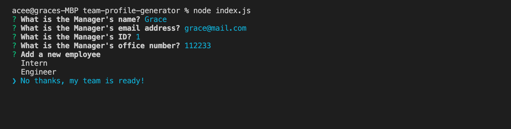
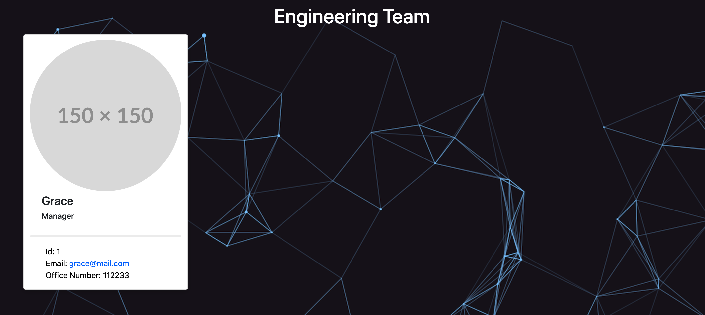

# Team Profile Generator
# Description
This project is made using Node Js and Npm packages such as inquirer and jest. In this project, the user/manager will use a command-line app where he/she can input his/her info and his team's basic info. After he/she finish inputing everyone's info it will  generate a webpage which displays the team's basic info. This way the manager will have access on everyone's github and emails.

The photos below shows the command-line and the generated html.

You can also watch the video of how this app works [here](https://drive.google.com/file/d/1LEo61otbR0FPVGLbOFBRoKY9IIYqMgrh/view).

# Table Of Contents
  * [Description](#description)
  * [Installation](#installation)
  * [Usage](#usage)
  * [License](#license)
  * [Contributing](#contributing)
  * [Tests](#tests)
  * [Questions](#questions)
# Installation
npm install
npm axios
# Usage
npm start
# Licence 
MIT
# Contributors
grace
# Test 

# Questions 
 
For more information you can check my Github account gracee19(https://github.com/gracee19). 
Please don't hesitate to ask questions you can email me at .
